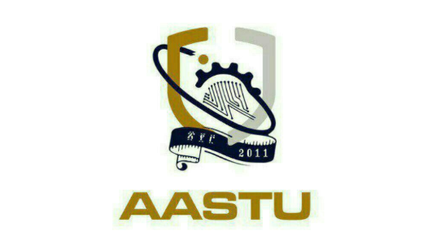

# College of Engineering  
## Department of Software Engineering  
### Software Engineering Methodologies (SEM)  

# Identifying Bad Smells in Code  

**Group 7** - Question 2: Identifying Bad Smells in Code  

## Group Members  
1. **Elbetel Shineda** - ETS0406/13  
2. **Leul Mintesnot** - ETS0766/13  
3. **Mihret Agegnehu** - ETS0874/13  
4. **Mikiyas Bedasa** - ETS0888/13  
5. **Natanim Ashenafi** - ETS0979/13  

---

**Submission Date:** April 2, 2025  
**Submitted to:** Instructor Dereje  
